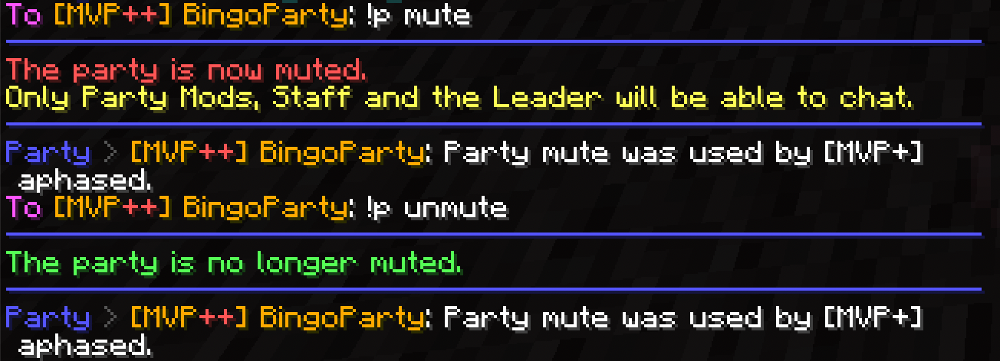

# BingoPartyTools

ChatTriggers module for Forge Minecraft 1.8.9 which helps in managing a Hypixel Skyblock "Bingo Party".



## Warning

This is my first (ChatTriggers) mod.
I may publish proper releases to their website, I may not.
Expect bugs and breakage. You have been warned.

With that said though, I am somewhat confident this works as expected and in a stable manner.


## Features

Using `/msg [current party leader] !p command (ign)`, you can moderate the party without being leader or even moderator rank.

For this, you **do not need to install** anything, only the (afk) party leader needs this CT module.

Example:

- `/msg BingoParty !p mute`
- `/msg BingoParty !p kick randomSpammer`

Before we get to the list of full commands though, an important announcement:


## If you have Skytils, …

… I’d strongly suggest setting a command alias. (Thanks ooffyy for thinking of this trick!)

This will drastically reduce the amount of typing (and perhaps thinking?) you need to do.

- Open Skytils settings menu (/st)
- Edit Aliases
- On the left, `ap`* will be replaced to `msg bingoparty !p` in the right field
- Save and Exit
- Congratulations, you can now simply `/ap mute` instead of having to type what was shown in the section above (:

\*A (skippable) word on this:

> The original preferred command would of course have been /bp as in **B**ingo**P**arty; however, in Skyblock backpacks exist (and will be opened from running that).
Thus we arrived at `/ap` (stands for aphasedParty), however you are free to name the command literally anything you like that isn’t already taken, if it fits you better. Others won't be influenced by your choice here whatsoever.


## All available commands

Commands listed in the same line are aliases of one another, meaning they **achieve the same** thing equally, and exist to accommodate more users.

However, the one used in the primary column is how this feature is referred to in the /bpt settings. Again, any will work, you can use whichever you prefer.

Features which work differently from Hypixel settings are explained.

|  Command  |                                                             Functionality                                                             |  Alias(es)   |
|-----------|---------------------------------------------------------------------------------------------------------------------------------------|--------------|
| disband   | is always disallowed                                                                                                                  |              |
| transfer  | self-explanatory, should not need to be used though                                                                                   |              |
| mute      | self-explanatory                                                                                                                      | unmute       |
| promote   | self-explanatory, but not even strictly required in this system                                                                       |              |
| kick      | self-explanatory                                                                                                                      | remove       |
| block     | kick/remove with additional ignore add                                                                                                | ban          |
| unblock   | revert ignore add, but don't re-invite                                                                                                | unban        |
| stream    | (re-)open party into a public one, with default size 100, useful e.g. after briefly transferring to a non-MVP++ ranked player         | public, open |
| invite    | self-explanatory                                                                                                                      | inv          |
| allinvite | toggles the party setting                                                                                                             |              |
| speak     | allowlisted people can talk in party chat during p mute even without mod rank                                                         | say          |
| rule      | output Bingo Brewers' rules as listed in the Discord channel, 1-7 (defaults to saying rule 1 in party chat if no number was provided) |              |
| help      | points to the link for this readme                                                                                                    |              |


## Example output

For each example, excluded are the messages Hypixel will potentially output, like
- `The party is now muted.`
- `The party is no longer muted.`

and so on.

- Regular commands:
    ```
    (for disband: I dare you to find out yourself)
    Party > [MVP++] BingoPartyLeader: Party was transferred to IGN2 by IGN.
    Party > [MVP++] BingoPartyLeader: Party was muted by IGN.
    Party > [MVP++] BingoPartyLeader: IGN2 was promoted by IGN.
    Party > [MVP++] BingoPartyLeader: IGN2 was kicked from the party by IGN.
    Party > [MVP++] BingoPartyLeader: IGN2 was removed from the party and blocked from rejoining by IGN.
    Party > [MVP++] BingoPartyLeader: Party size was set to {number, default 100} by IGN.
    Party > [MVP++] BingoPartyLeader: IGN invited IGN2 to the party.
    Party > [MVP++] BingoPartyLeader: IGN toggled allinvite setting.
    Party > [MVP++] BingoPartyLeader: IGN: {message}
    ```
- Rules output, e.g. for rule #1:
    ```
    Party > [MVP++] BingoPartyLeader: --- Bingo Brewers rules ---
    Party > [MVP++] BingoPartyLeader: Rule #1: Do not ask when a splash is. It's when you get pinged in #splashes.
    ```
- For help, you will receive the following direct message back:
    ```
    From [MVP++] BingoPartyLeader: For a list of available commands see github dot com/aphased/bingopartytools
    ```
- Also, if any setting is toggled off on the party leader's side e.g. due to unexpected breakage, you will see this message:
    ```
    From [MVP++] BingoPartyLeader: This setting is currently disabled. (commandName)
    ```
- If you use an invalid command, you will be informed by:
    ```
    From [MVP++] BingoPartyLeader: Hi IGN, use !p help
    ```
    (which of course as a reminder, with the Skytils command alias set up, will merely be `/ap help` in this example)


## Thanks

Thank you for testing & helping with fresh ideas to:
- Tryp0MC
- ooffyy
- p0iS
- Calva
- Hype_the_Time
- NotOgfishyboi
- KiLLz_StRoMzY
- BossFlea
- BatmanCrtns
- PotjeZout
- mafrylikebedwars/p0iS_enjoyer

Special thanks for the BingoBrewers Discord server & its community to:
- indigo_polecat
- HunterHiHunter


## In case of issues…

… catch me in-game or on Discord, with the same name as used here.


## License

BingoPartyTools is open-sourced software licensed under the [MIT License](https://opensource.org/licenses/MIT).

